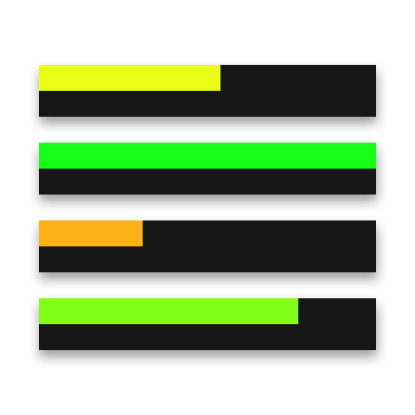
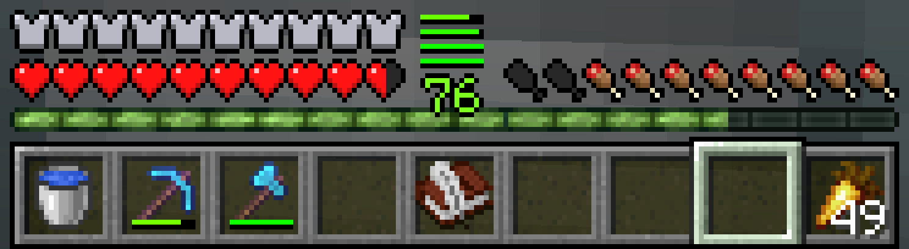

# microDurability-unofficial

> **26.2 Community Port**: Based on [ReviversMC/microDurability](https://github.com/ReviversMC/microDurability), with added Minecraft 26.2 (Fabric) support. Original authors: dzwdz & ReviversMC.

**microDurability** is a minimal durability viewer that shows the durability bars of your armor right above the hotbar, without wasting any space. It can also warn you when your tools or armor are about to break.

## License

This project is licensed under **MPL-2.0**, except for the `microdurability-core` module which is licensed under **CC-BY-NC-SA-4.0**.

| Module | License |
|--------|---------|
| All modules except `microdurability-core` and `microdurability-dev-env-extras` | MPL-2.0 |
| `microdurability-core` | CC-BY-NC-SA-4.0 |
| `microdurability-dev-env-extras` | CC-BY-NC-SA-4.0 |

Original authors: dzwdz & ReviversMC. This is an unofficial community port.
